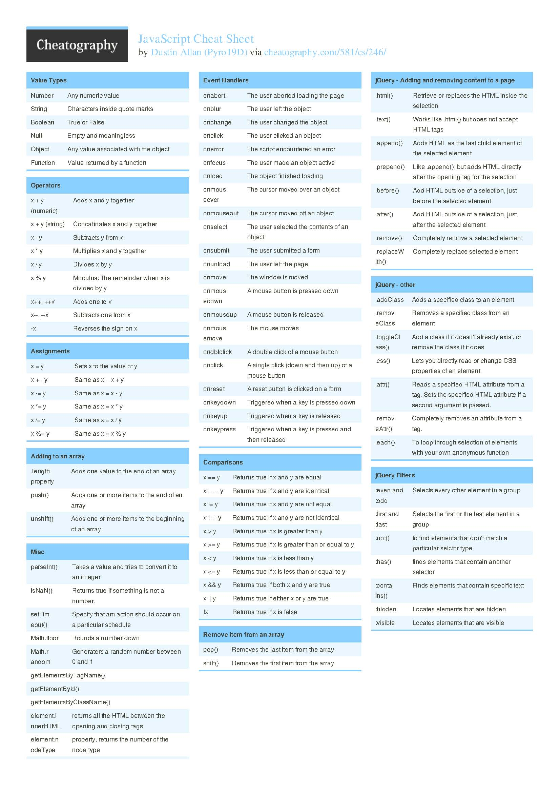

# JavaScript for POSTMAN Automation Test Cases

# JavaScript Basics
[JavaScript Basics.md](JavaScript%20Basics.md)

# Write the POSTMAN Test cases in Collection
[Postman Testcases.md](Postman%20Testcases.md)

# Variables in POSTMAN and collection finish
## Global Variables
## Collection Variables 
## variables within the script
## Environment variables

Important Sessions to watch
[PostmanVariables.md](PostmanVariables.md)
